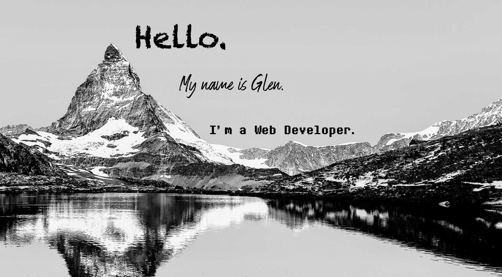

My Portfolio

https://glen-hood-portfolio.herokuapp.com/

I created a portfolio to provide work samples for potential employers. This site has the ability to navigate to my previous work once the portfoilio is loaded. The site also includes my name and a recent photo. Also, the site has provided links that guide the user to an "About Me", "Work", and linkable contact buttons. When this page is resized, it is resposive and adapts to the users viewpoint. This site includes links to my email, Github repositories, LinkedIn page, and loads a PDF of my resume.
    

Credits-
www.w3schools.com was used as refrence
Robert Kurle (tutor) assisted with some design questions
